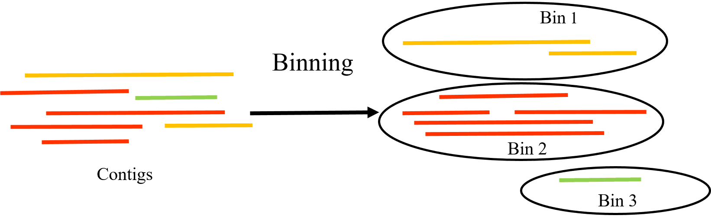

# Binning

## Contexto

O passo de binning se trata do processo de agrupar sequências montadas da metagenômica (contigs/scaffolds) que provavelmente pertencem ao mesmo organismo.

{fig-align="center"}

## Arquivos e ambiente conda necessários {#sec-bdalign}
Desative o ambiente conda "metagenomicsTraining'
```bash
conda deactivate
```
Ative o ambiente conda "binning"
```bash
conda activate binning
```
Arquivos necessários:

```bash
final.contigs.fa
SRR579292_1.fastq
SRR579292_2.fastq
```

Mude o diretório atual para `"Pipeline/data/megahit/SRR579292"`

## Preparativos para a execução dos softwares de binning

Faça a indexação dos contigs

```bash
bowtie2-build final.contigs.fa contigs_db
```

Mapeie as reads:

```bash
bowtie2 -x contigs_db -1 ../../SRR579292_1.fastq -2 ../../SRR579292_2.fastq -p 12 | samtools view -bS - | samtools sort -@ 12 -o SRR579292_sorted.bam
```

Faça a indexação do arquivo BAM

```bash
samtools index SRR579292_sorted.bam
```
Gere a profundidade

```bash
jgi_summarize_bam_contig_depths --outputDepth depth.txt SRR579292_sorted.bam
```
## Executando o Metabat2
```bash
 metabat2 -i final.contigs.fa -a depth.txt -o ../../../bins/metabat/bin -t 12 --minContig 1500
```
## Executando o Maxbin2

```bash
 run_MaxBin.pl -contig final.contigs.fa -abund depth.txt -out ../../../bins/maxbin/maxbin -thread 12
```

## Arquivos e ambiente conda necessários para executar o CONCOCT
Desative o ambiente conda "binning'
```bash
conda deactivate
```
Ative o ambiente conda "concoct_env"
```bash
conda activate concoct_env
```
## Fragmentar contigs
O CONCOCT trabalha melhor quebrando contigs grandes.

```bash 
cut_up_fasta.py final.contigs.fa -c 10000 -o 0 -m -b ../../../bins/concoct/contigs_10K.bed > ../../../bins/concoct/contigs_10K.fa
```
Gere a tabela de cobertura
```bash
concoct_coverage_table.py ../../../bins/concoct/contigs_10K.bed SRR579292_sorted.bam > ../../../bins/concoct/coverage_table.tsv
```
Execute o CONCOCT
```bash
concoct --composition_file ../../../bins/concoct/concoct_contigs_10K.fa --coverage_file ../../../bins/concoct/coverage_table.tsv -b ../../../bins/concoct/
```
Mescle clusters fragmentados

```bash
merge_cutup_clustering.py ../../../bins/concoct/clustering_gt1000.csv > ../../../bins/concoct/clustering_merged.csv
```
## Preparar para DASTool
Desative o ambiente conda "concoct_env'
```bash
conda deactivate
```
Ative o ambiente conda "binning"
```bash
conda activate binning
```
## Converter MetaBAT2
```bash
Fasta_to_Contig2Bin.sh -i ../../../bins/metabat/ -e fa > ../../../bins/metabat/metabat_scaffolds2bin.tsv
```
## Converter MaxBin2
```bash
Fasta_to_Contig2Bin.sh -i ../../../bins/maxbin/ -e fasta > ../../../bins/maxbin/maxbin_scaffolds2bin.tsv
```
## Alteração do formato dos arquivos de bins do CONCOCT
O DASTool espera separação de elementos por TAB (\t), mas o CONCOCT gera CSV com vírgula. 
O DASTool geralmente não interpreta headers.
Remova a header do seu arquivo tsv e substitua o uso de vírgula por tab.

```bash
cat ../../../bins/concoct/clustering_merged.csv | tr ',' '\t' > ../../../bins/concoct/clustering_merged.tsv
tail -n +2 ../../../bins/concoct/clustering_merged.tsv > ../../../bins/concoct/clustering_merged_noheader.tsv
```

## DASTool

```bash
DAS_Tool -i ../../../bins/metabat/metabat_scaffolds2bin.tsv,../../../bins/maxbin/maxbin_scaffolds2bin.tsv,../../../bins/concoct/clustering_merged_noheader.tsv -l metabat,maxbin,concoct -c final.contigs.fa -o ../../../dastool/dastool --search_engine diamond --threads 12 --write_bins
```
## Analisando a qualidade dos bins pré e pós refinamento do DASTool
O BUSCO fornece medidas para avaliação quantitativa da montagem do genoma, do conjunto de genes e da completude do transcriptoma, com base em expectativas evolutivamente informadas do conteúdo genético de ortólogos de cópia única quase universais.

Mude para o diretório **Pipeline/dastool**

Desative o ambiente conda "binning'
```bash
conda deactivate
```
Ative o ambiente conda "metagenomicsTraining"
```bash
conda activate metagenomicsTraining
```
## Executando o BUSCO

```bash
 busco -i ../bins/maxbin/maxbin.001.fasta -o busco_maxbin001 -m genome -l bacteria_odb10 -c 12
```
Visualize o resultado de forma gráfica:

```bash
busco --plot busco_maxbin001
```
